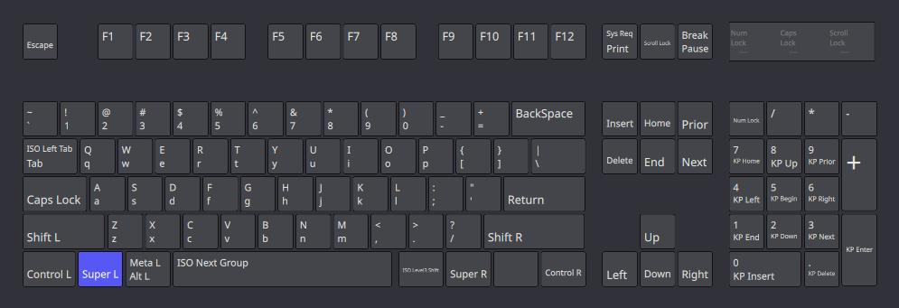
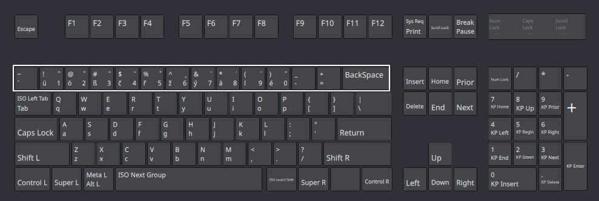
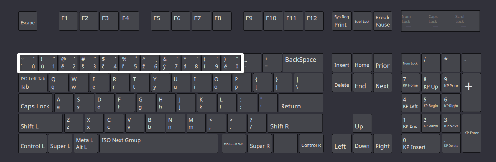

# The ‘Multilingual (Plato)’ keyboard layout

This repository contains a custom keyboard layout that combines the convenience of the US layout for programming needs while seamlessly integrating separate English, Czech, and German keyboard layouts for efficient typing in multiple languages without sacrificing speed or comfort.

## Motivation

If you've ever used the Czech Programmer keyboard layout for an extended period, you understand the frustration of switching between languages. The absence of certain German symbols and the discomfort of using _AltGr_ to access special characters can significantly hinder typing speed and productivity.

I have also explored dead key layouts, which can work well for multilingual typing but require extra keypresses for each special letter, leading to a cumulative slowdown.

To address these issues and enhance the typing experience for programmers who use English, Czech, or German, this multilingual keyboard layout offers a smart and streamlined solution.

## Key Features

- **Boosted Typing Speed**: The ergonomic layout and efficient language switching contribute to improved typing speed and productivity, making it an ideal choice for programmers who occasionally need to type in multiple languages.
- **Mostly Unmodified US Layout**: The layout retains the familiar US keyboard layout, making it ideal for programming tasks without the need to relearn key placements or shortcuts.
- **Efficient Language Switching**: Switching between English, Czech, and German is simple and intuitive, thanks to changing only the numbers row. The rest of the keyboard layout remains consistent, ensuring comfort and ease of use.
- **Enhanced Comfort and Productivity**: The layout is designed with ergonomic considerations to reduce strain and fatigue during long typing sessions, boosting productivity for programmers who occasionally work with multiple languages.

## Included layouts

### English (US, unmodified)

### German

### Czech

## How to Use

### Installation

#### Linux

1. Copy the file `Linux/pm` into `/usr/share/X11/xkb/symbols` (this adds the layout to your system)
2. Add the XML snippet from `Linux/evdev.xml` into the `<layoutList>` section in `/usr/share/X11/xkb/rules/evdev/xml` (this makes )
3. If on Ubuntu, clear XKB cache with `sudo dpkg-reconfigure xkb-data` and/or restart, on KDE Plasma log out and in.
4. Add all 3 layouts to your keyboard.

### Usage

The layout remains unchanged from the US keyboard with the exception of the number row.

- **basic** `key` produces a letter in the language (with the exception of `ú` in Czech)
- `Shift + key` produces the special symbol
- `AltGr + key` produces the number
- `Shift + AltGr + key` produces the corresponding key as per the US layout

## Contributing

We welcome contributions from the community to further improve and refine the multilingual keyboard layout. If you have any suggestions, bug fixes, or additional language support to offer, feel free to submit a pull request. Let's work together to make this keyboard layout a go-to solution for multilingual programmers.

## License

This repository is licensed under the [MIT License](LICENSE). You are free to use, modify, and distribute the layout following the terms and conditions of the MIT License.

## Acknowledgments

I would like to express my gratitude to the Michal Měchura ([@michmech](https://www.github.com/michmech))  for providing his [Multilingual layout](https://github.com/michmech/mx)) thanks to which I could learn how to create my own layout and the [article in the Ubuntu documentation](https://help.ubuntu.com/community/Custom%20keyboard%20layout%20definitions) which let me understand the system deeper.